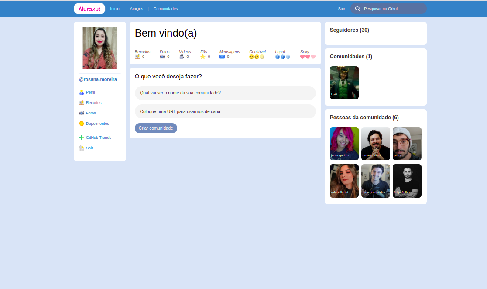

# AluraKut
# Descrição do Projeto
<p align="center">
Projeto construido durante a Imersão React edição Alurakut da Alura!
</p>

<h1 align="center">
  
</h1>
### Pré-requisitos

Antes de começar, você vai precisar ter instalado em sua máquina as seguintes ferramentas:
[Git](https://git-scm.com), [Node.js](https://nodejs.org/en/). 
Além disto é bom ter um editor para trabalhar com o código como [VSCode](https://code.visualstudio.com/)

### 🎲 Rodando a Aplicação

```bash
# Clone este repositório
$ git clone <https://github.com/rosana-moreira/AluraKut.git/>

# Acesse a pasta do projeto no terminal/cmd
$ cd AluraKut

# Instale as dependências
$ yarn

# Execute a aplicação em modo de desenvolvimento
$ yarn dev

# O servidor do front-end inciará na porta:3000 - acesse <http://localhost:3000>


```